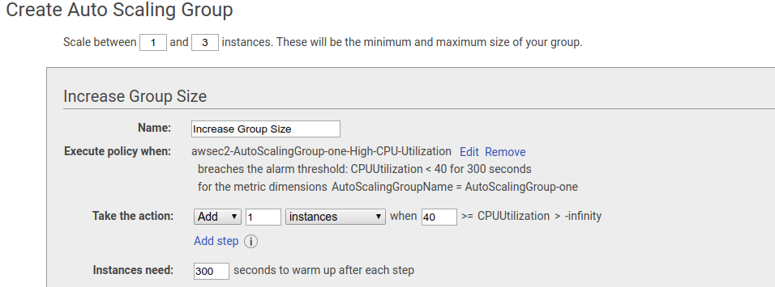
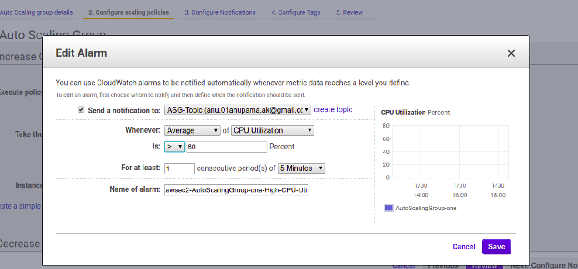
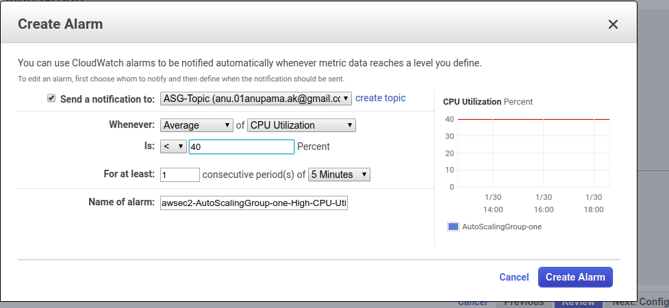
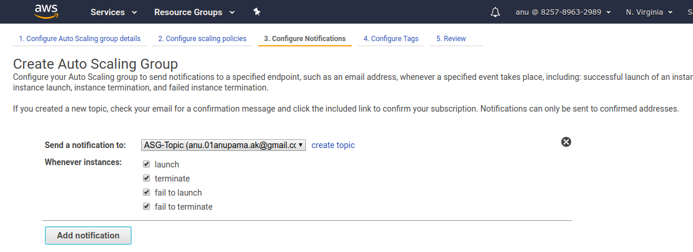
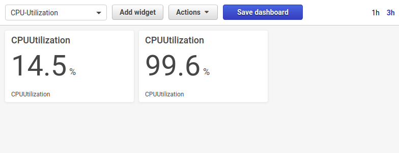
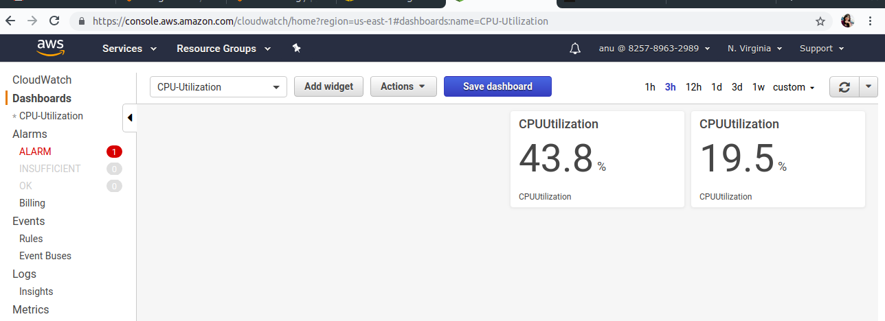
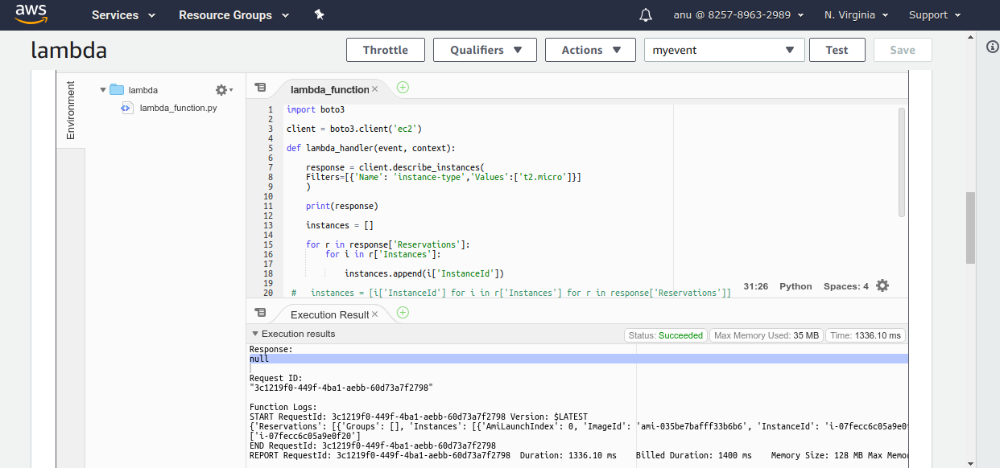
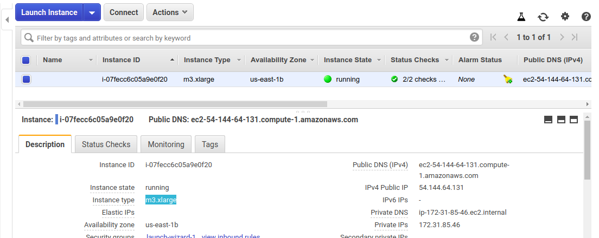

## AlgoWorks Assignment

1. Task1

>Create a free account on AWS and set up a autoscaling based EC2 serves with min 1: max 3 and autoscaling policy of CPU usage > 80% and downscaling policy of 
>CPU usage < 40%

## Steps

> Create AWS free account 


 
> Setup: Launch Configuration

- Go to EC2 console and click on Launch Configuration from Auto Scaling


- Choose AMI and then Choose Instance Type

- On Configure details, name the launch configuration and enable detail monitoring 


- After that, Add the storage and Security Groups

- Click on Create launch configuration and choose the existing key pair or create new key pair


> Setup: Auto Scaling Group

- From EC2 console click on Auto Scaling Group which is below the launch configuration. Then click on create auto scaling group.

- configure group name, group initial size, and VPC and subnets .


- Configure the scaling policies. On scaling policy page, you can specify the minimum and maximum number of instance in this group

  As perthe requirement the min_size = 1 and max_size = 3




-  As it works based on alarm, create the alarm by clicking on ‘add new alarm’.
   Here the alarm created is based on CPU utilization. If CPU utilization crosses 80% the auto scaling launches new instances based on the step action.
   And if CPU Utilization is less than 40% it terminates the instance. 


 


- Next: Configure Notification’ to get the notification based on launch, terminate, and fail etc.



- Check the CPU load on the running instance ( goto CloudWatch and create a Dashboard based on the metric)

- Increase the CPU Utilization of your running instance with the following command

```
	dd if=/dev/zero of=/dev/null

```



- New Instance launched via Auto Scaling Group


- Now, to scale in decrease the CPU utilization via command

```
    killall yes

	or
   `CTRL + C`

```

- It triggers another alarm and received the notification , one for threshold < 40 other for instance termination via ASG




## TASK2

> Write some lambda functions to trigger upscale and downscale

* Scaling Concept

  > Vertical Scalibility( Scaling Up || Scaling Down)

   Vertical scalability is the ability to increase the capacity of existing hardware or software by adding resources - 
   for example, adding processing power to  server to make it faster.

   So, Here i have changed the instance type( which determines the compute, memory, and storage capabilities ) 
   from t2.micro to m3.xlarge( scaling up) via Lambda Function


```
# BOTO is the AWS SDK for Python . So importing boto3 as lambda supports python 

import boto3 

# Create a low-level client with the service name (here is ..ec2)

client = boto3.client('ec2')

# lambda_handler - entry point of the Lambda function 

def lambda_handler(event, context):

    response = client.describe_instances(
    Filters=[{'Name': 'instance-type','Values':['t2.micro']}]
    )
    
    print(response)
    
    instances = []
    
    for r in response['Reservations']:
        for i in r['Instances']:
        
            instances.append(i['InstanceId'])
 
     
    print(instances)
    
# Stop the instances using waiters  which automatically poll for pre-defined status changes in AWS resources

    client.stop_instances(InstanceIds=instances)
    waiter=client.get_waiter('instance_stopped')
    waiter.wait(InstanceIds=instances)

# Change the instance type to scale out 

    for i in instances:
        client.modify_instance_attribute(InstanceId=i, Attribute='instanceType', Value='m3.xlarge')

# Start the instance again 

    client.start_instances(InstanceIds=instances)
     

```
   


After executing the lambda the instance type changed to m3.xlarge




> NOTE:And vice-versa we can do the same thing for scaling down.
  


